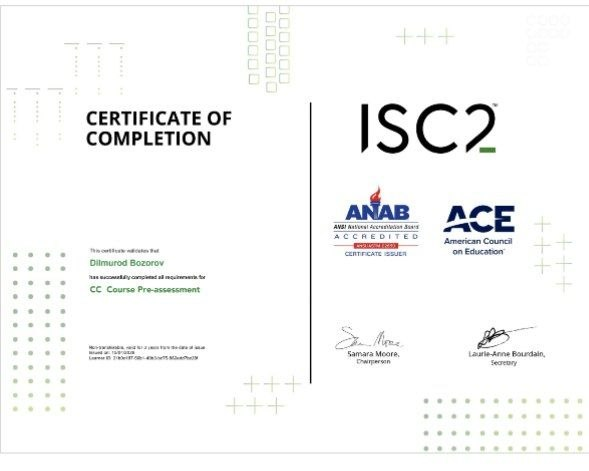
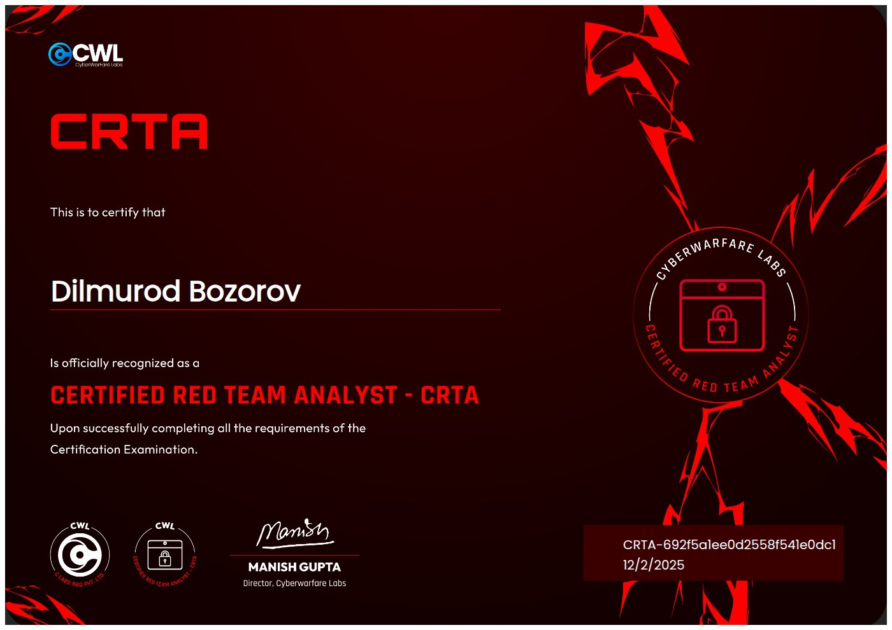
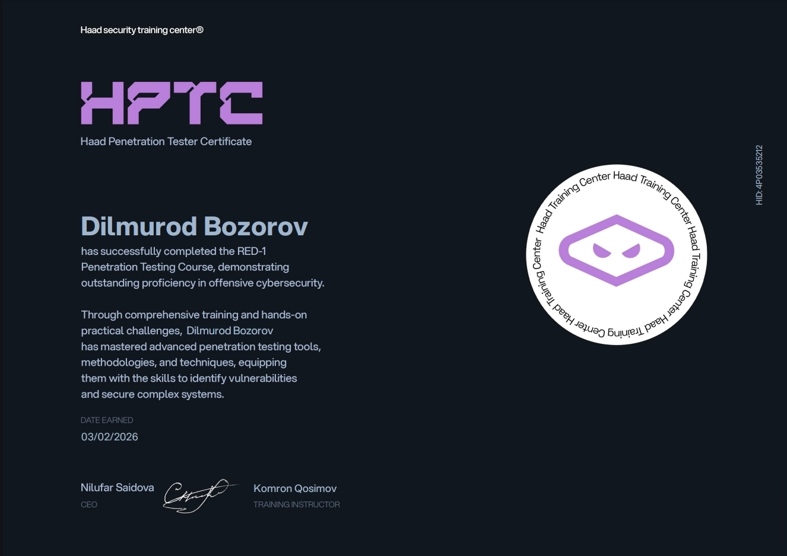

  

  

  

<h1 align="center">👨‍💻 Dilmurod Bozorov</h1>

💻 Junior Penetration Tester | Cybersecurity Enthusiast

  

---

## 💻 Live Terminal

    root@kali:~# whoami
    dilmurod

    root@kali:~# role
    Junior Penetration Tester

    root@kali:~# skills
    XSS | SQL Injection | LFI | Privilege Escalation

    root@kali:~# tools
    Burp Suite | Nmap | Metasploit | Gobuster

    root@kali:~# status
    Hunting bugs... Exploiting... Learning...

---

## 🧠 About Me

- 🔐 Passionate about Offensive Security  
- 🧪 Practicing on HTB & Vulnyx labs  
- 🐧 Linux & Privilege Escalation  
- 🎯 Goal: Become Professional Pentester  
- 📚 Always learning & improving  

---

## ⚔️ Offensive Security Stack

---

## 🧠 Web Exploitation

---

## 🛠️ Tools Arsenal

---

## 🧬 Methodology

---

## 🧠 Currently Learning

---

## 🏆 Certifications

  
  

  
  

📎 Full Proof:
👉 https://drive.google.com/your-link

## 🚨 Featured Writeups

I have completed **20+ vulnerable machines** on Vulnyx platform and created detailed penetration testing reports.

📂 **Full Reports Collection:**  
🔗 [View All Vulnyx Reports](https://gratis-diagnostic-8e1.notion.site/Vulnyx-29aa8f5be51e80cfb302e75bbc26ca03)
✔ Includes:
- 🔍 Reconnaissance & Enumeration  
- 💥 Exploitation (LFI, RCE, Brute Force, etc.)  
- 🔐 Privilege Escalation  
- 📄 Professional Reporting  

---

### 🧪 Vulnyx - Ready
- 🔍 Enumeration  
- 💥 Exploitation  
- 🔐 Privilege Escalation  

📎 Report: https://gratis-diagnostic-8e1.notion.site/READY-Easy-299a8f5be51e8063b6fbda24bfc388a7  

---

### 🧪 Vulnyx - Explorer
- 🔍 Recon  
- 💥 Exploitation  
- 🔐 Root Access  

📎 Report: https://gratis-diagnostic-8e1.notion.site/Explorer-29aa8f5be51e8041be0dc4cd91e6d070  

---

### 🧪 Vulnyx - Apex
- 🔍 Enumeration  
- 💥 Exploitation  
- 🔐 Privilege Escalation  

📎 Report: https://gratis-diagnostic-8e1.notion.site/Apex-2a2a8f5be51e8055956cdd3c947dfbbe  

---

## 📂 Projects

- 🔗 Pentest Reports: https://github.com/dilmurod-sec/pentest-reports  
- 🌐 Portfolio: https://dilmurod-bozorov-uz.netlify.app/  

---

## 📊 GitHub Stats

  
  

---

## 🔥 Streak Stats

  

---

## 🏆 Achievements

  

---

## 🐍 Contribution Snake

---

## 🎯 Goals

- 🧠 OSCP (in progress)  
- 🛡️ Bug Bounty Hunter  
- 💻 Full-time Pentester  

---
---

## 📄 Resume

  

---
## 📫 Contact

- 📧 Email: Dilmuroddilshodovic@gmail.com  

---

  

